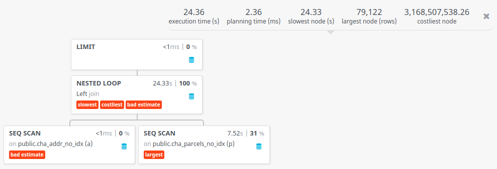
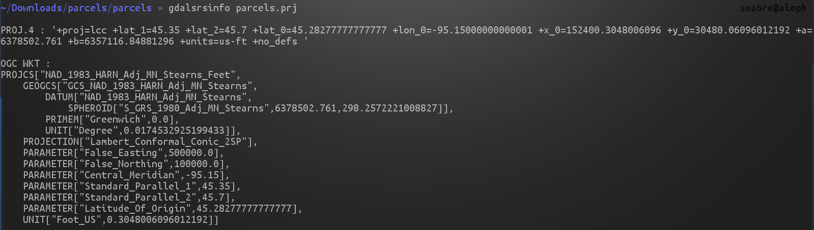
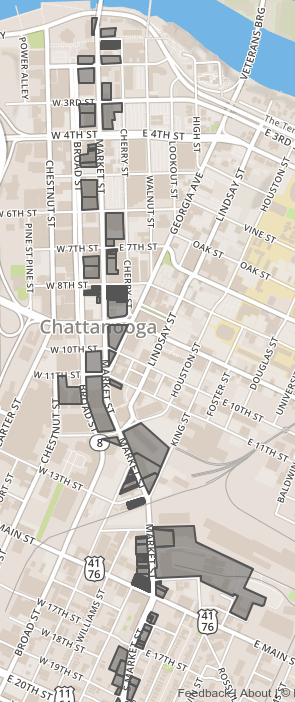
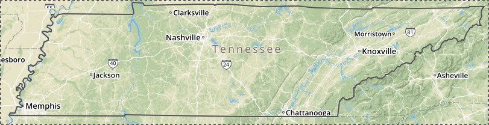
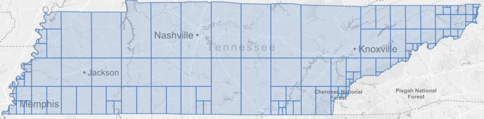
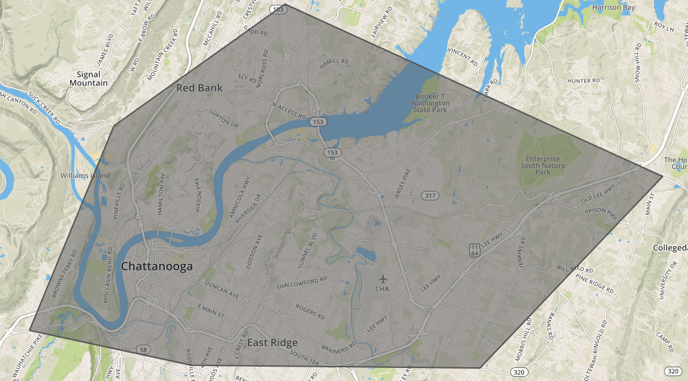

"Hey, where are these spatial indexes?"

Adventures of PostGIS in Production

---

# We've Been At It A While

* PostGIS in production since about 2013
* Serve a bunch of geospatial data. Includes OSM and our customer's various geospatial data
* Peak at about 10 million requests/mo 

---

# Whyyy

* Mostly wanted to address mistakes most people make with PostGIS
* Noticed people working way too hard
* I hear "I didn't know PostGIS could do that" _all_ _the_ _time_

---

# Most Common Issues In My Experiences

* Not using spatial indexes
* Confusion with PostGIS data types and Coordinate Reference Systems
* Not taking advantage of Postgres/PostGIS built-in functionality

---

I want to try my best to address most of these issues.

---

# Indexes

---

# My General Philosophy

* Don't index everything, dang it.
* Index only what you need. Use `EXPLAIN ANALYZE` to figure out if an index on a column will help.
  * `EXPLAIN ANALYZE SELECT * FROM my_table;`

---

# Spatial Indexes

---

Should you index your geometry columns?

---

# Yes

---

* One thing I've noticed too is that your common import tools (shp2pgsql and ogr2ogr) may not include spatial indexes
* Once your tables get in the thousands you _will_ see slow performance.

---

Let's compare two similar queries. The only difference is one query's tables don't have spatial indexes. The other's does.

---

# With Index: Query
```sql
SELECT *
FROM cha_addr_with_idx a
       LEFT JOIN cha_parcels_with_idx p ON ST_Contains(p.geom, a.wkb_geometry) LIMIT 1000;
```

# With Index: Performance
Average Runtime: 49.088ms

---

# With Index: Query Plan


---

# Without Index: Query
```sql
SELECT *
FROM cha_addr_no_idx a
       LEFT JOIN cha_parcels_no_idx p ON ST_Contains(p.geom, a.wkb_geometry) LIMIT 1000;
```

# Without Index: Performance
Average Runtime: 24,546.889ms

---

# With Index: Query Plan


---

# So what kind of index do I want

* GiST: Generalized Search Tree
  * Not just for geospatial data. Pretty much any kind of data that can overlap (e.g. arrays)
  * Great as long as index size isn't greater than available RAM. If it is, consider looking at BRIN.

---

# Creating the index

---

```sql
CREATE INDEX cha_addr_no_idx_wkb_geometry_index
  ON public.cha_addr_no_idx
  USING GIST (wkb_geometry);
```

---

# PostGIS Data Types

---

# Geography

* Uses geodetic measurement  
* Always represented in WGS 84 lon lat degrees
* Measurement functions always expect input as and return results in meters
* Best if you need to do computations over a large area (large state or continent) and/or want accuracy
  * There is a performance cost.
* If you don't know what you are doing use this type.
* Certain PostGIS functions don't work with it. Must cast to geometry.

---

# Geometry

* Uses cartesian measurement
* Use whatever SRS you want
* Use whatever PostGIS function you want

---

# If you think you chose the wrong type for your table

* You can change it in your table or query. It's usually not a big deal.
* You can change it permanent in your table with `UpdateGeometrySRID`. e.g. `SELECT UpdateGeometrySRID('my_table','my_geo_column', 4326);`
* You can change it in your query with `ST_Transform` e.g. `SELECT ST_Transform(my_geo_column, 4269) FROM my_table;`
* You can also cast to geography if you want to transform to geography e.g. `SELECT my_geo_column::geography from my_table;`

---

I don't know what SRS my data is. How can I find out?

---

Two options:
* Your columns may be constrained to a particular one, so check out your schema.
* Or check your geometry directly `SELECT ST_SRID(geom) from my_table;`

---

The SRS I want doesn't exist but I really want to use it.

---

You need to insert a record into the `spatial_ref_sys` table, which has the following definition:

---

```sql
CREATE TABLE spatial_ref_sys ( 
  srid       INTEGER NOT NULL PRIMARY KEY, 
  auth_name  VARCHAR(256), 
  auth_srid  INTEGER, 
  srtext     VARCHAR(2048), 
  proj4text  VARCHAR(2048) 
)
```

---

Let's use North America Albers Equal Area Conic as an example.
You need to know:
* The Well-Known Text representation of the Spatial Reference System.
* The Proj4 coordinate definition string for a particular SRID.

---

If you don't have any of these handy, http://epsg.io is a good resource.

---

Or if you have a shapefile with a `.prj` file, you can run `gdalsrsinfo` on it

---



---

With that info, if we have what we need we can add our SRS.

---

INSERT into spatial_ref_sys (srid, auth_name, auth_srid, proj4text, srtext)
values (102008,
        'ESRI',
        102008,
        srtexthere,
        proj4texthere);
---

And we can transform an existing geometry to that SRS.

---

```sql
SELECT ST_Transform(geom, 102008) FROM my_table;
```

---

# I have no idea what SRS I should use and I want PostGIS to figure it out for me.

---

# `_ST_BestSRID`
* Tries to pick UTM zone, polar stereographic, or to a mercator as last resort.
* Used by the Geography type for certain functions e.g. `ST_Buffer`: http://postgis.net/docs/PostGIS_Special_Functions_Index.html#PostGIS_TypeFunctionMatrix
* Could potentially fail to pick a projection.
* It is a private function, so it is not documented.

---

```sql
SELECT ST_Transform(ST_Transform(geom, _ST_BestSRID(geom)) from my_table
```

---

# "Oh wow, Postgres and PostGIS can do that?"

---

# JSON

* Postgres can natively operate on JSON and has types (JSON and JSONB) that allow you to store JSON
* JSONB is noteworthy because its _indexable_, making queries that need to operate on JSON fast
* We use GeoJSON _a lot_, but we don't store it _as_ GeoJSON. Though we use Postgres a lot to generate JSON, which I want to talk about

---

# Generate GeoJSON From Your Data

```sql
SELECT ST_AsGeoJSON(geom) AS my_geojson FROM my_table;
```

---

<table border="1" style="border-collapse:collapse">
<tr><th>my_geojson</th></tr>
<tr><td>{&quot;type&quot;:&quot;Point&quot;,&quot;coordinates&quot;:[-85.233605,35.0832938]}</td></tr>
<tr><td>{&quot;type&quot;:&quot;Point&quot;,&quot;coordinates&quot;:[-85.2724527,35.0493086]}</td></tr>
<tr><td>{&quot;type&quot;:&quot;Point&quot;,&quot;coordinates&quot;:[-85.2853555,35.0377829]}</td></tr>
<tr><td>{&quot;type&quot;:&quot;Point&quot;,&quot;coordinates&quot;:[-85.3018474,35.0192342]}</td></tr></table>

---

# Convert A Query To GeoJSON

---

```sql
SELECT row_to_json(fc)
FROM (SELECT 'FeatureCollection' AS type, array_to_json(array_agg(f)) AS features
      FROM (SELECT 'Feature'                                                   AS type,
                   ST_AsGeoJSON(mt.geom) :: json                               AS geometry,
                   row_to_json((SELECT t FROM (SELECT my_table_id, my_table_item) AS t)) AS properties
            FROM my_table AS mt) AS f) AS fc;

```

---

Let's say we want to grab all parcels on Market St. and display that as GeoJSON

---

```sql
SELECT row_to_json(fc)
FROM (SELECT 'FeatureCollection' AS type, array_to_json(array_agg(f)) AS features
      FROM (SELECT 'Feature'                                                                           AS type,
                   ST_AsGeoJSON(chas.geom) :: json                                                     AS geometry,
                   row_to_json((SELECT cha FROM (SELECT gid, mastname, macity, 'TN' AS state) AS cha)) AS properties
            FROM cha_parcels_with_idx AS chas
            WHERE macity = 'CHATTANOOGA'
              AND typesfx = 'ST'
              AND stname = 'MARKET') AS f) AS fc;
```

---



---

# Simplify Polygons

PostGIS has `ST_Simplify` which implements the Ramer-Douglas–Peucker simplification algorithm:
```
geometry ST_Simplify(geometry geomA, float tolerance);
```

---

# Unsimplified


---

# Simplified


---

# Turn Boundaries To Polygons and vice verse

* `ST_ExteriorRing` takes a polygon and converts it to an outline.
* `ST_MakePolygon` takes an outline and converts it to a polygon.

---



```sql
SELECT ST_ExteriorRing(geom) FROM tennessee_whole;
```

---


```sql
SELECT ST_MakePolygon(geom) FROM tennessee_whole_line;
```
---

# Split big polygons into a bunch of smaller ones

`ST_Subdivide(geometry geom, integer max_vertices=256);`

---



---

Let's say I want to figure how how many Subway restaurants there are in Chattanooga.

---

```sql
SELECT count(DISTINCT(geom))
FROM cha_businesses
WHERE "business n" LIKE '%SUBWAY%'
  AND city = 'CHATTANOOGA'
```

Yields 31.

---

So what area does that cover exactly? Can we visualize that?

---

```sql
SELECT ST_ConvexHull(ST_Collect(geom))
FROM cha_businesses
WHERE "business n" LIKE '%SUBWAY%'
  AND city = 'CHATTANOOGA'
```

---




---

What if I'm at the aquarium and I want to find the closest Subway so I can get a sandwich.

---

```sql
SELECT ST_Distance(ST_Transform(geom, 3662),
                   ST_Transform(ST_SetSRID(ST_MakePoint(-85.311086, 35.055753), 4326), 3662)) / 5280 AS d,
       "business n",
       "street dir",
       "street num",
       "street nam",
       "street suf",
       "city",
       "state",
       "zip"
FROM cha_businesses
WHERE "business n" LIKE '%SUBWAY%'
  AND city = 'CHATTANOOGA'

ORDER BY ST_Transform(geom, 3662) <-> ST_Transform(ST_SetSRID(ST_MakePoint(-85.311086, 35.055753), 4326), 3662)
limit 10;
```

---

<table border="1" style="border-collapse:collapse">
<tr><th>d</th><th>business n</th><th>street dir</th><th>street num</th><th>street nam</th><th>street suf</th><th>city</th><th>state</th><th>zip</th></tr>
<tr><td>0.5168637644049433</td><td>SCENIC CITY SUBWAY #16282</td><td>NULL</td><td>208</td><td>FRAZIER</td><td>AVE</td><td>CHATTANOOGA</td><td>TN</td><td>37405</td></tr>
<tr><td>0.6542807510309095</td><td>CHATTANOOGA SUBWAY #4014</td><td>NULL</td><td>850</td><td>MARKET</td><td>ST</td><td>CHATTANOOGA</td><td>TN</td><td>37402</td></tr>
<tr><td>0.6542807510309095</td><td>SUBWAY SANDWICHES AND SALADS</td><td>NULL</td><td>850</td><td>MARKET</td><td>ST</td><td>CHATTANOOGA</td><td>TN</td><td>37402</td></tr>
<tr><td>1.261728424758831</td><td>SUBWAY</td><td>E</td><td>979</td><td>3RD</td><td>ST</td><td>CHATTANOOGA</td><td>TN</td><td>37403</td></tr>
<tr><td>2.511786963294291</td><td>SCENIC CITY SUBWAY 2267</td><td>NULL</td><td>3127</td><td>BROAD</td><td>ST</td><td>CHATTANOOGA</td><td>TN</td><td>37408</td></tr>
<tr><td>2.750917870740592</td><td>SUBWAY #25008</td><td>NULL</td><td>2610</td><td>AMNICOLA</td><td>HWY</td><td>CHATTANOOGA</td><td>TN</td><td>37406</td></tr>
<tr><td>2.8590235205819137</td><td>MELISSA&#39;S SUBWAY, LLC</td><td>NULL</td><td>2333</td><td>MCCALLIE</td><td>AVE</td><td>CHATTANOOGA</td><td>TN</td><td>37404</td></tr>
<tr><td>2.8590235205819137</td><td>CHATTANOOGA SUBWAY #53183</td><td>NULL</td><td>2333</td><td>MCCALLIE</td><td>AVE</td><td>CHATTANOOGA</td><td>TN</td><td>37404</td></tr>
<tr><td>2.9490039641986137</td><td>SUBWAY #40655</td><td>NULL</td><td>601</td><td>SIGNAL MOUNTAIN</td><td>RD</td><td>CHATTANOOGA</td><td>TN</td><td>37405</td></tr>
<tr><td>3.0175841895129123</td><td>CHATTANOOGA SUBWAY #60915</td><td>NULL</td><td>2525</td><td>DE SALES</td><td>AVE</td><td>CHATTANOOGA</td><td>TN</td><td>37404</td></tr></table>

---

FIN
